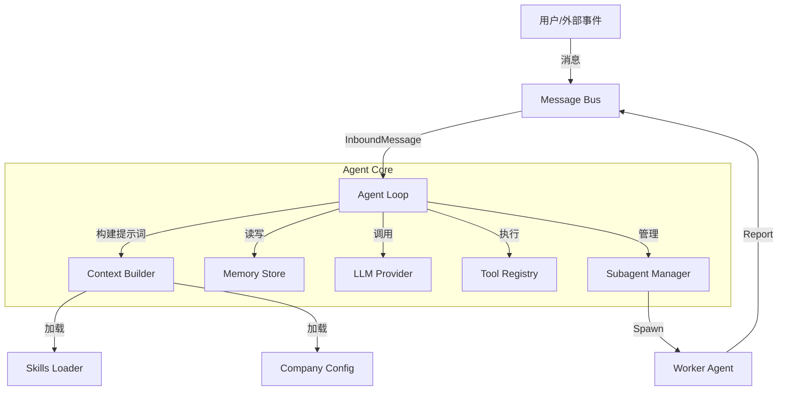
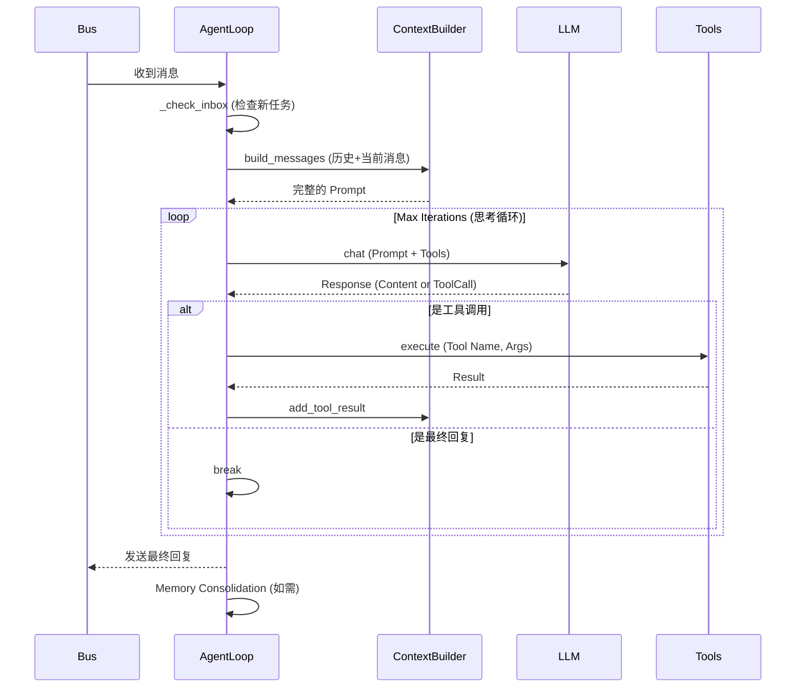

# Agent 核心组件 (Agent Core)

`nanobot/agent` 是整个系统的“大脑”，负责协调感知、记忆、决策和行动。它实现了基于 LLM 的自主代理循环，并支持子代理（Subagent）的并行执行。

## 架构概览

Agent 组件由以下几个关键模块组成，它们协同工作以处理任务：

## 核心模块详解

### 1. Agent Loop (`loop.py`)

`AgentLoop` 类是主控制循环。它负责从消息总线接收消息，并协调 LLM 交互和工具执行。

**主要职责：**
- **消息处理 (`_process_message`)**: 接收并解析输入消息。
- **上下文构建**: 调用 `ContextBuilder` 准备发送给 LLM 的消息历史。
- **思考-行动循环 (`_run_agent_loop`)**: 这是一个标准的 ReAct (Reasoning and Acting) 循环。

**执行流程：**

### 2. Context Builder (`context.py`)

`ContextBuilder` 负责将各种碎片化的信息组装成 LLM 能理解的连贯 Prompt。

**组装内容包括：**
1.  **Identity (身份)**: 基础的 `nanobot` 身份或特定的 `Company Post` 角色设定。
2.  **Bootstrap Files**: `AGENTS.md`, `SOUL.md` 等定义的规则。
3.  **Memory**: `MEMORY.md` 中的长期记忆摘要。
4.  **Skills**: 已加载技能的详细说明或可用技能的摘要列表。
5.  **Runtime Info**: 当前时间、操作系统、工作区路径等动态信息。
6.  **Conversation History**: 最近的对话记录。

### 3. Subagent Manager (`subagent.py`)

`SubagentManager` 赋予了 Agent "分身" 的能力。它允许主 Agent 创建独立的后台工作线程来处理特定任务。

**特性：**
- **隔离性**: 每个 Subagent 都有独立的 `ContextBuilder` 和 `MemoryStore` (位于 `memory/workers/{id}/`)，互不干扰。
- **轻量级**: 共享同一个 LLM Provider 和 Message Bus。
- **生命周期**:
    1.  **Spawn**: 分配 Task ID，注册到 `WorkerRegistry`。
    2.  **Run**: 在后台 `asyncio.Task` 中运行精简版的 Agent Loop。
    3.  **Report**: 任务完成后，通过 `system` 频道将结果发回给主 Agent。

### 4. Memory Store (`memory.py`)

双层记忆系统，旨在平衡上下文窗口限制和信息持久化：

- **Long-term Memory (`MEMORY.md`)**: 
    - 存储：由 LLM 提炼的事实、用户偏好、项目背景。
    - 用法：每次构建 Context 时都会被完整读取并放入 System Prompt。
- **History Log (`HISTORY.md`)**:
    - 存储：所有原始对话的流水账。
    - 用法：不直接加载进 Prompt。Agent 需要通过 `grep` 工具搜索此文件来回忆具体细节。
- **Events (`EVENTS.jsonl`)**:
    - 存储：结构化的系统事件日志（用于审计）。

### 5. Worker Registry (`worker_registry.py`)

一个简单的数据持久化层，用于跟踪所有活跃和历史 Worker (Subagent) 的状态。

- **存储位置**: `company/workers.json`
- **记录字段**: Worker ID, Post ID (职位), 状态 (active/completed/failed), 当前任务, 创建/更新时间。
