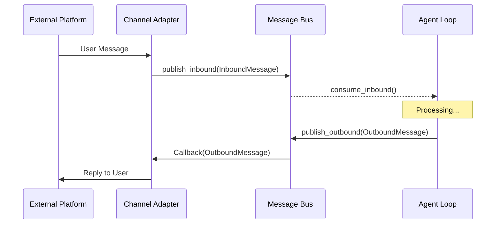

# Bus 消息总线 (Message Bus)

`nanobot/bus` 组件实现了系统内部的异步事件总线，负责解耦 Agent 核心逻辑与外部通信渠道。

## 设计理念

采用 **生产者-消费者** 模型：
- **Channels (生产者)**: 将外部消息封装为 `InboundMessage` 并推入 `inbound` 队列。
- **Agent (消费者/生产者)**: 从 `inbound` 队列消费消息，处理后将结果封装为 `OutboundMessage` 推入 `outbound` 队列。
- **Channels (消费者)**: 订阅 `outbound` 队列，获取属于自己的回复并发送给用户。

## 核心数据结构 (`events.py`)

### InboundMessage (入站消息)
- `channel`: 来源渠道 (e.g., "telegram", "wechat")
- `sender_id`: 发送者 ID
- `chat_id`: 会话 ID
- `content`: 文本内容
- `media`: 媒体文件 URL 列表
- `session_key`: 自动生成的会话唯一键 (`channel:chat_id`)

### OutboundMessage (出站消息)
- `channel`: 目标渠道
- `chat_id`: 目标会话 ID
- `content`: 回复内容
- `media`: 媒体文件列表
- `metadata`: 渠道特定的元数据 (如 Slack 的 `thread_ts`)

## MessageBus (`queue.py`)

`MessageBus` 类管理两个 `asyncio.Queue` 并提供订阅机制。

### 核心方法

- `publish_inbound(msg)`: 渠道调用，推送新消息。
- `consume_inbound()`: Agent 调用，获取待处理消息。
- `publish_outbound(msg)`: Agent 调用，推送回复。
- `subscribe_outbound(channel, callback)`: 渠道调用，注册回调函数以接收回复。

### 数据流图



## 代码示例

### 1. 推送消息 (模拟渠道)

```python
from nanobot.bus.events import InboundMessage

await bus.publish_inbound(InboundMessage(
    channel="console",
    sender_id="user1",
    chat_id="main",
    content="Hello World"
))
```

### 2. 订阅回复 (模拟渠道)

```python
async def send_to_console(msg: OutboundMessage):
    print(f"Bot: {msg.content}")

# 注册回调
bus.subscribe_outbound("console", send_to_console)

# 启动分发循环 (通常在后台运行)
asyncio.create_task(bus.dispatch_outbound())
```
