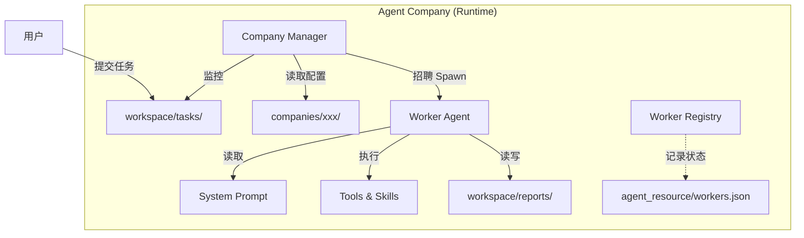

# Nanobot Agent Company: 理念与实现深度解析

> "我们认为大规模 Agent 协作的关键不在于增加单个 Agent 的智力，而在于建立清晰的组织架构和标准化的作业流程。"

**Nanobot Company** 是一个基于 **nanobot** 轻量级框架构建的“Agent 公司”系统。它通过模拟现实世界的**科层制 (Bureaucracy)** 和 **公文流 (Document Flow)**，将多个 AI Agent 组织成一个高效、可控、可扩展的协作实体。

本文将详细介绍其核心理念、架构设计及关键技术实现。

---

## 1. 核心理念 (Core Philosophy)

### 1.1 科层制即服务 (Bureaucracy as a Service)
在软件工程中，“官僚”通常是一个贬义词。但在 Agent 协作中，**科层制是实现稳定性的基石**。
- **岗位 (Post)**：通过 `POSTS.md` 明确定义每个 Agent 的职责边界、权限和技能。
- **层级 (Hierarchy)**：Manager 负责调度，Worker 负责执行，权责分明。
- **非人格化 (Impersonality)**：系统只认“岗位”不认“具体的 Agent 实例”。一个 Worker 完成任务后即销毁，新的任务由新生成的 Worker 接手，保证了系统的无状态性和可扩展性。

### 1.2 公文流驱动 (Document Flow Driven)
现实世界中，跨部门协作往往通过“单据”、“申请表”、“报告书”来完成。Nanobot Company 沿用了这一设计：
- **无隐式通信**：Agent 之间不进行直接的内存共享或函数调用。
- **唯一的交互界面**：**Markdown 文件**。
- **流程**：`Manager` 发布《任务书》(Task Order) -> `Worker` 领取并执行 -> `Worker` 提交《工作报告》(Report)。
这种设计使得系统的每一步操作都**天然可审计、可追溯、可调试**。

### 1.3 PDCA 闭环 (PDCA Cycle)
所有工作流都遵循 **Plan (计划) -> Do (执行) -> Check (检查/审计) -> Act (处理)** 的循环。
- 不仅仅是执行任务，更强调对执行结果的**验证 (Check)**。
- 通过 Cron Service 或审计岗位 Agent 来定期审查 `workspace` 中的产出物，确保交付质量。

---

## 2. 系统架构 (System Architecture)

系统基于 **nanobot** 极简核心 (~4000行代码) 进行扩展，主要包含以下组件：

### 2.1 多公司架构 (Multi-Company)
为了支持不同的业务场景（如“天气预报”、“科技新闻”、“代码审计”），系统引入了**多公司 (Multi-Company)** 架构。
- **配置隔离**：每个公司有独立的配置目录 `companies/<company_name>/`。
- **按需启动**：通过 `nanobot company run --name <name>` 启动特定公司实例。

### 2.2 动态岗位 (Dynamic Posts)
Worker 不是常驻进程，而是**按需生成 (Spawn)** 的。
- 当 Manager 发现一个任务需要 `Post_Weather_Analyst` 处理时，它会现场“招聘”一个 Agent。
- 这个 Agent 会加载 `POSTS.md` 中定义的 System Prompt 和 `SKILL.md` 中定义的工具集。
- 任务完成后，该 Agent 实例（及其短期记忆）被销毁，只保留产出的文档和 `agent_resource` 中的履历记录。

### 2.3 人力资源数据库 (HR Registry)
为了将“运行时状态”与“静态配置”分离，我们引入了类似 HR 部门的 **Worker Registry**。
- 存储位置：`workspace/agent_resource/workers.json`
- 作用：记录所有 Worker 的生命周期状态（活跃、完成、失败）和任务历史。这为后续的绩效评估和审计提供了数据基础。

---

## 3. 关键实现机制 (Key Mechanics)

### 3.1 零配置分发 (Zero-Conf Dispatch)
为了简化单一用途公司的使用，我们实现了**默认岗位 (Default Post)** 逻辑。
- **传统模式**：编写 `routes.json`，使用正则表达式匹配文件名（如 `TASK_WEATHER_.*`）来分发任务。
- **简化模式**：在 `SKILL.md` 中设置 `default_post: Post_Weather_Analyst`。
    - **效果**：所有丢入 `workspace/tasks/` 的文件，无论叫什么名字，统统交给这个默认岗位处理。这极大地降低了用户的使用门槛。

### 3.2 技能加载器 (Company Loader)
`CompanyConfigLoader` 是连接静态 Markdown 配置与动态 Python 代码的桥梁。
- 它解析 `SKILL.md` 中的 YAML Frontmatter。
- 它读取 `POSTS.md`，使用正则提取岗位定义。
- 它实现了配置的**热加载**（在每次 Run 时重新读取），允许用户在运行时调整岗位描述 Prompt。

### 3.3 文档规范 (Schema Enforcement)
通过 `DOCS_SCHEMA.md`，Manager 可以“教”Worker 如何写文档。
- Worker 的 System Prompt 会包含它需要输出的文档模板。
- 这保证了无论更换多少个底层的 LLM 模型，产出的报告格式始终保持一致，便于下游程序处理。

---

## 4. 总结

Nanobot Company 探索了一条不同于主流 "Multi-Agent Chat"（群聊模式）的协作道路。
我们不让 Agent 聚在一起“开会”（这往往导致上下文爆炸和话题跑偏），而是让他们像一家严谨的跨国公司一样，通过**传阅公文**来异步协作。

这种模式牺牲了一定的实时性，但换来了极高的**稳定性、可维护性和可扩展性**，特别适合处理那些流程长、对结果确定性要求高的企业级任务。
